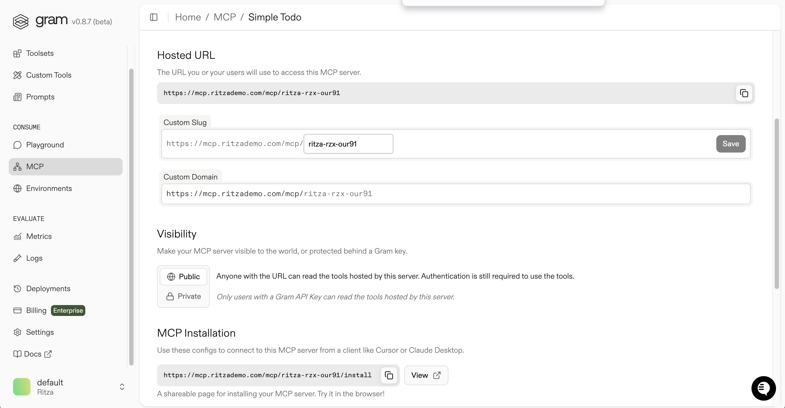
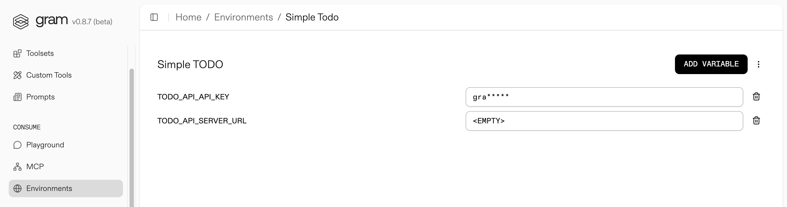

## Brief

- **Example server**: ritzademo.com domain on Namecheap: already setup as a custom domain on Gram - set it as example server
- Help reader:
	- understand MCP registry and how to use with Gram (if makes sense)
		-> **IF** not possible - explain registry and why connecting to Gram does not make sense
	    -> **IF** something wrong with Gram preventing publishing to registry - open a bug report

## Create Gram MCP server and link to custom domain

- toolsets have MCP server @ Gram URL
	- can link custom domain to have MCP server at  `mcp.{{your-domain}}.com/{{server-name}}`

> [!info] Host your MCP at a custom domain
> Custom domains require upgrading to a pro account type.
 
👉 login to https://app.getgram.ai/ using matt@ritza.co account

- https://docs.getgram.ai/gram-quickstart
	- create MCP server
		- used EXISTING basic `todo-api` API source (with OpenAPI spec) from https://app.getgram.ai/ritza-rzx/default/toolsets
			- API endpoint: `https://api.ritzademo.com` for example: `https://api.ritzademo.com/todos`
			- GitHub repo: https://github.com/ritza-co/acme-todo

	- create a toolset
		- all `todo-api` tools
	- Enable MCP server - https://app.getgram.ai/ritza-rzx/default/mcp/simple-todo
		- set to public
	- checked it works in playground https://app.getgram.ai/ritza-rzx/default/playground - it works

- link custom domain


## deploy server

https://docs.getgram.ai/host-mcp/deploy-mcp-server
- create API and add to Simple Todo environment



## Add to Cursor

https://app.getgram.ai/mcp/ritza-rzx-our91

 - used pass-through authentication to make it work

```
{
  "mcpServers": {
    "GramSimpletodo": {
      "command": "npx",
      "args": [
          "mcp-remote",
          "https://mcp.ritzademo.com/mcp/ritza-rzx-our91",
          "--header",
          "MCP-TODO-API-API-KEY:${VALUE}"
        ]
    }
  }
}
```

## Publish MCP server to Registry

Guide: https://github.com/modelcontextprotocol/registry/blob/main/docs/guides/publishing/publish-server.md

- deployment options to make your MCP server available
	- package, remote, and hybrid
		- use remote - hosted as a web service that clients connect to directly
		
> From Gram docs intro (https://docs.getgram.ai/introduction): *MCP servers are mostly **local** which creates friction through replicated setup work and lack of centralized control. We believe the industry will evolve toward **Managed** MCP servers, where API producers handle hosting, security, and enterprise features.*

### Install publisher CLI

```bash
brew install mcp-publisher
```

### Initialize Your server.json

> -> MCP server GitHub repo: https://github.com/ritza-co/acme-todo/blob/main/app.py - for app hosted at https://api.ritzademo.com/

- clone repo and push changes to it

```shell
cd /path/to/your/mcp-server
mcp-publisher init
```

- creates `server.json`

### Configure Your Server Details


### Authenticate - DNS authentication

For command:

```bash
echo "yourcompany.com. IN TXT \"v=MCPv1; k=ed25519; p=$(openssl pkey -in key.pem -pubout -outform DER | tail -c 32 | base64)\""
```

copy output and add as value to new TXT DNS record - create in namecheap: https://ap.www.namecheap.com/Domains/DomainControlPanel/ritzademo.com/advancedns

> Waiting for DNS propagation

❌ ERROR with command:

```shell
mcp-publisher login dns --domain yourcompany.com --private-key $(openssl pkey -in key.pem -noout -text | grep -A3 "priv:" | tail -n +2 | tr -d ' :\n')
```

```
Logging in with dns...
Error: failed to get token: failed to exchange dns signature: token exchange failed with status 401: {"title":"Unauthorized","status":401,"detail":"DNS authentication failed","errors":[{"message":"no valid MCP public keys found in DNS TXT records"}]}
```

- someone had same issue: https://github.com/modelcontextprotocol/registry/issues/385

> tldr: Instead of the subdomain `_mcp-registry.letta.com`, you should put the TXT record on `letta.com`.


### Publish Your Server


> [!warning] remove key.pem
> Remove BEFORE publishing


### Verify Publication

- use name in search: https://registry.modelcontextprotocol.io/v0/servers?search=com.ritzademo/acme-todo

